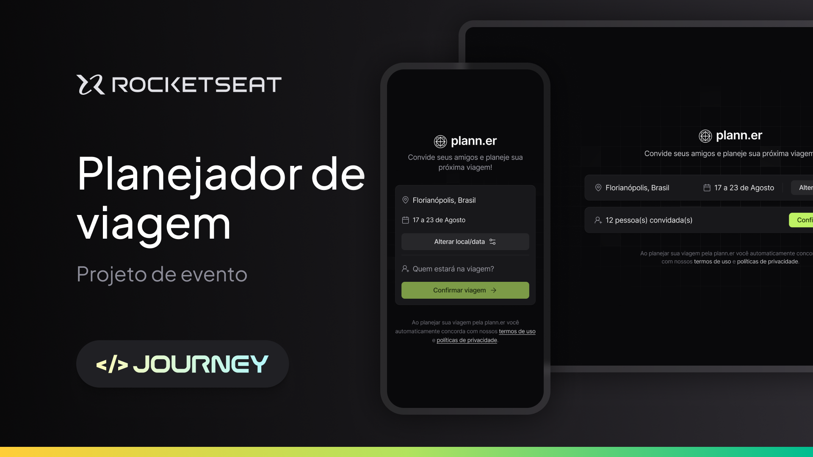
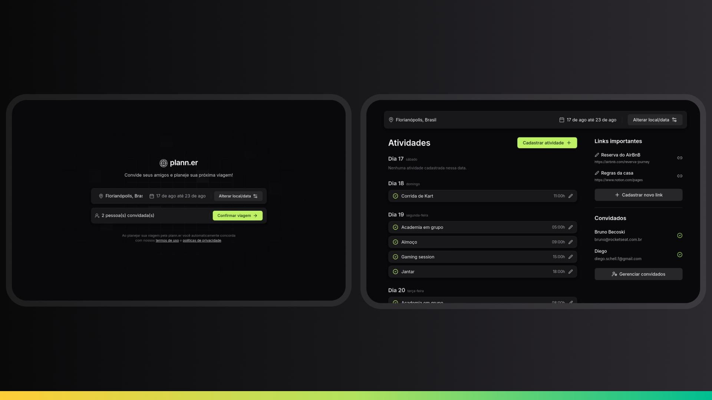
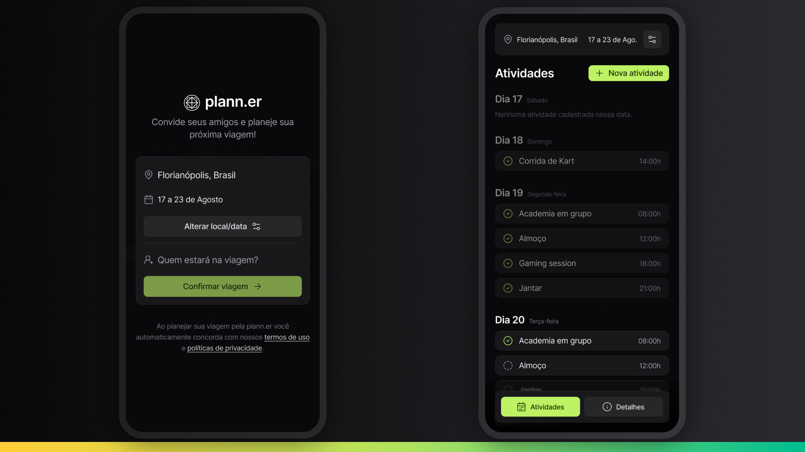
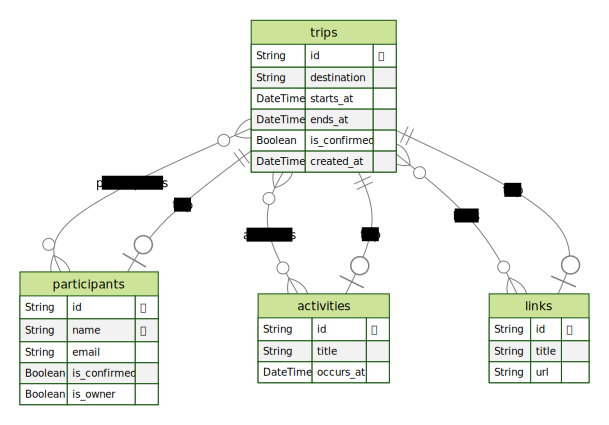

# NLW Journey

## O projeto é um site um app e um back-end para montar planos de viagem com amigos, registrar atividades e links úteis.

# Font-end

## Tecnologias Utilizadas

- [Vite](https://vitejs.dev)
- [React](https://react.dev)
- [TypeScript](https://www.typescriptlang.org)
- [TailwindCSS](https://tailwindcss.com)
- [React Router](https://reactrouter.com)

# Mobile

## Tecnologias Utilizadas

- [Expo](https://expo.dev)
- [React Native](https://reactnative.dev)
- [TypeScript](https://www.typescriptlang.org)
- [NativeWind](https://www.nativewind.dev)
- [React Navigation](https://reactnavigation.org)

# Back-end

## Tecnologias Utilizadas

- [Fastify](https://fastify.dev)
- [Prisma](https://www.prisma.io)
- [TypeScript](https://www.typescriptlang.org)
- [Nodemailer](https://nodemailer.com)

